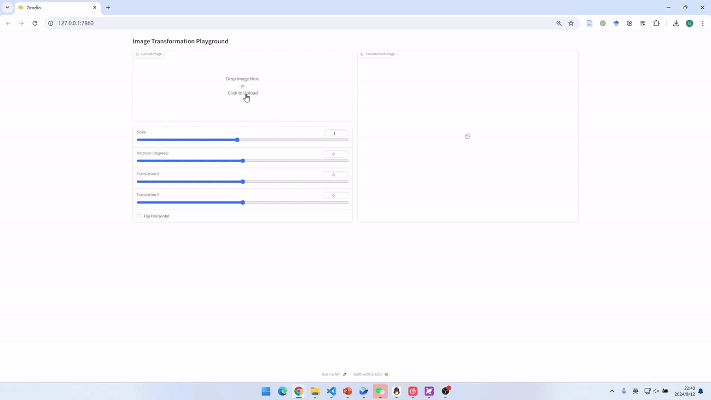
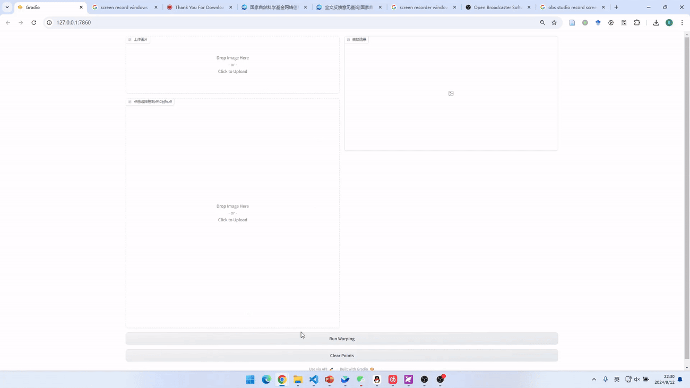

# Assignment 1 - Image Warping

### 1. Basic Image Geometric Transformation (Scale/Rotation/Translation).
Fill the [Missing Part](run_global_transform.py#L21) of 'run_global_transform.py'.


### 2. Point Based Image Deformation.

Implement MLS or RBF based image deformation in the [Missing Part](run_point_transform.py#L52) of 'run_point_transform.py'.

---

## Implementation of Image Geometric Transformation

This repository is [Your Name]'s implementation of Assignment 01 of DIP.

---

## Requirements

To install requirements:

```setup
python -m pip install -r requirements.txt
```

---

## Running

To run basic transformation, run:

```bash
python run_global_transform.py
```

To run point guided transformation, run:

```bash
python run_point_transform.py
```

---

## Method Description

### 1. Basic Image Geometric Transformation

基于仿射变换矩阵的复合实现缩放、旋转、平移和翻转。所有变换均以图像中心为基准，采用反向映射（Backward Mapping）结合双线性插值完成像素采样。

**复合变换顺序：**

$$M = F \cdot T_{\text{translate}} \cdot T_{\text{back}} \cdot R \cdot S \cdot T_{\text{to\_origin}}$$

| 变换 | 矩阵 |
|------|------|
| 缩放 $s$ | $\text{diag}(s, s, 1)$ |
| 旋转 $\theta$ | $[\cos\theta, -\sin\theta; \sin\theta, \cos\theta]$ |
| 平移 $(t_x, t_y)$ | 偏移矩阵 |
| 水平翻转 | $\text{diag}(-1, 1, 1)$ + 偏移 |

### 2. Point Guided Deformation (MLS Affine)

基于 Moving Least Squares (MLS) Affine 模式实现点引导图像变形。对输出图像每个像素 $v$，利用控制点对 $\{(p_i, q_i)\}$ 求最优局部仿射变换：

**权重：**
$$w_i(v) = \frac{1}{\|v - p_i\|^{2\alpha}}$$

**加权重心：**
$$p^* = \frac{\sum_i w_i p_i}{\sum_i w_i}, \quad q^* = \frac{\sum_i w_i q_i}{\sum_i w_i}$$

**最优仿射矩阵：**
$$A = \left(\sum_i w_i \hat{p}_i^T \hat{p}_i\right)^{-1} \left(\sum_i w_i \hat{p}_i^T \hat{q}_i\right)$$

**映射：**
$$f(v) = (v - p^*) \cdot A + q^*$$

---

## Results

### Basic Transformation

> 缩放示例（Scale）

<!-- 在此处替换为实际截图路径 -->


> 旋转示例（Rotation）


> 平移示例（Translation）


> 水平翻转示例（Flip）


> 综合变换 Demo（Gif）



---

### Point Guided Deformation (MLS)

> 单点变形示例


> 多点变形示例


> 点引导变形 Demo（Gif）



---

## Acknowledgement

>📋 Thanks for the algorithms proposed by [Image Deformation Using Moving Least Squares](https://people.engr.tamu.edu/schaefer/research/mls.pdf) and [Image Warping by Radial Basis Functions](https://www.sci.utah.edu/~gerig/CS6640-F2010/Project3/Arad-1995.pdf).
