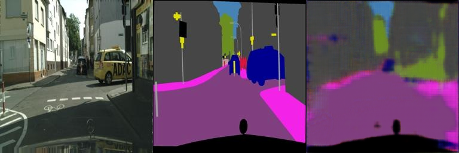
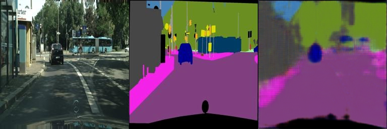

# Assignment 2 - DIP with PyTorch

### 1. Implement Poisson Image Editing with PyTorch.
Fill the [Polygon to Mask function](run_blending_gradio.py#L95) and the [Laplacian Distance Computation](run_blending_gradio.py#L115) of 'run_blending_gradio.py'.

### 2. Pix2Pix implementation.
See [Pix2Pix subfolder](Pix2Pix/).

---

## Implementation of DIP with PyTorch

This repository is Shen Haowei's implementation of Assignment 02 of DIP.

---

## Requirements

To install the required libraries:

```setup
pip install torch torchvision gradio opencv-python numpy
```

---

## Running

To run the Poisson Image Editing Gradio App:

```bash
python run_blending_gradio.py
```

To train the Pix2Pix (U-Net) model:

```bash
cd Pix2Pix
python train.py
```

---

## Method Description

### 1. Poisson Image Editing
基于 PyTorch 优化器机制实现泊松图像融合（Poisson Image Blending）。算法致力于将前景目标无缝融合到背景图像中：
- **Mask Generation**: 利用 `cv2.fillPoly` 将前端用户绘制的多边形顶点（Polygon Points）转换为二值化 Mask。为防止坐标越界导致程序崩溃，对多边形坐标做了边界裁剪处理。
- **Laplacian Loss**: 利用 PyTorch 的 2D 卷积（`F.conv2d`）计算拉普拉斯梯度。使用的拉普拉斯算子核为：
  ```math
  K = \begin{bmatrix} 0 & 1 & 0 \\ 1 & -4 & 1 \\ 0 & 1 & 0 \end{bmatrix}
  ```
- **Optimization**: 当检测到有效的 Mask 时，计算合成图像（融合目标）的拉普拉斯图与源前景图像拉普拉斯特征在 Mask 区域内的 L1 距离作为 Loss；结合 PyTorch 自动求导（Autograd），反复迭代直接更新 Target 区域像素，最终使得边界渐变更加自然无缝。

### 2. Pix2Pix Image-to-Image Translation (U-Net)
在 `Pix2Pix/FCN_network.py` 中实现了基于全卷积网络（FCN）和跳跃连接（Skip Connections）的 **U-Net** 模型架构，以实现图像到图像的翻译任务。
- **Network Architecture**: 
  - **Encoder**: 包含 5 层卷积区块（由 `Conv2d`, `BatchNorm2d`, `ReLU` 组成），不断下采样提取图像深层语义特征。
  - **Decoder**: 包含 5 层反卷积（特征上采样）。在解码阶段，将同尺寸的 Encoder 特征经过 `torch.cat`（通道维度拼接）跨层传递，补偿了标准 FCN 在下采样过程中丢失的空间细节，使得生成图像的边缘更清晰、纹理更丰富。
- **Data Processing**: 为了兼容大小不一的数据集（如 Facades, Cityscapes, Maps 混合训练），在自定义 `Dataset` 中增加了图片的固定标准化 Resize 处理（$512 \times 256$）；同时针对 Windows 环境输出的特点，采用 `utf-8-sig` 解码成功解析自动生成的图片列表配置文件。
- **Loss Function**: 直接采用 L1 Loss 计算生成图与 Ground Truth 的像素级绝对误差，在数据扩充策略的加持下成功实现模型平稳收敛。

---

## Results

### Poisson Image Editing

> Gradio 界面融合示例

<!-- 在此处替换为实际泊松融合结果截图路径 -->


---

### Pix2Pix (U-Net)

> 混合数据集生成效果
> (从左到右依次为: Input, Ground Truth, Model Output)

<!-- 在此处替换为实际的 val_results 截图路径 -->




---

## Acknowledgement

>📋 Assignments based on:
- [Poisson Image Editing](https://www.cs.jhu.edu/~misha/Fall07/Papers/Perez03.pdf)
- [Image-to-Image Translation with Conditional Adversarial Nets (Pix2Pix)](https://phillipi.github.io/pix2pix/)
- [Fully Convolutional Networks for Semantic Segmentation (FCN)](https://arxiv.org/abs/1411.4038)
