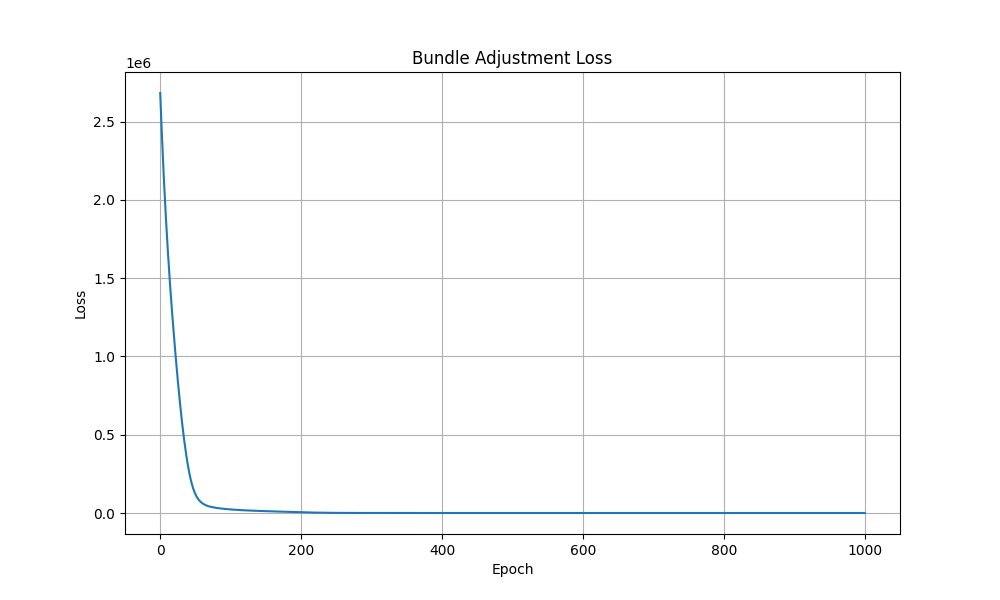
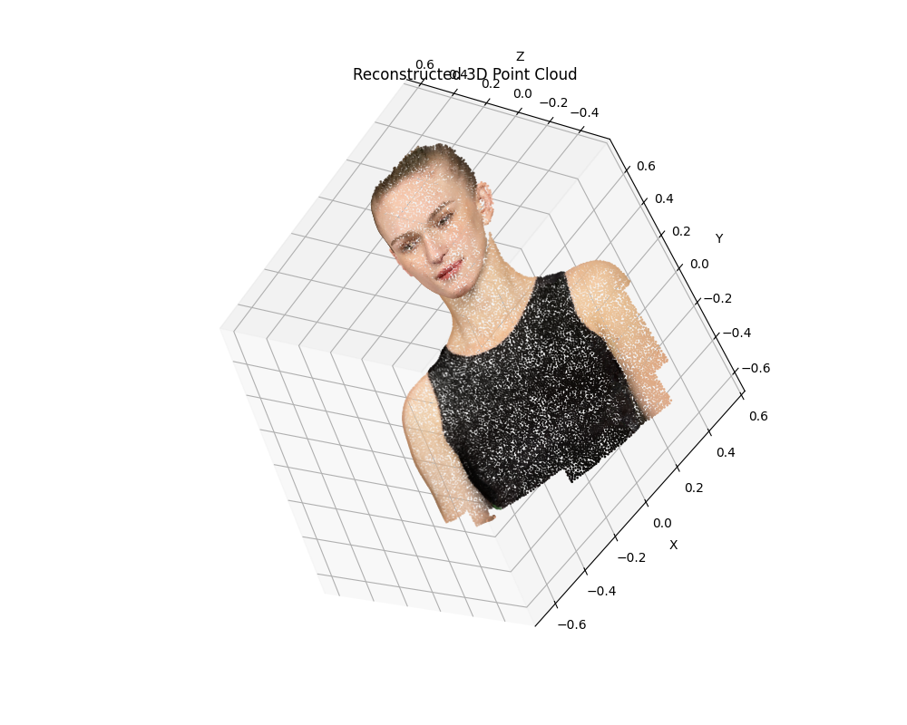
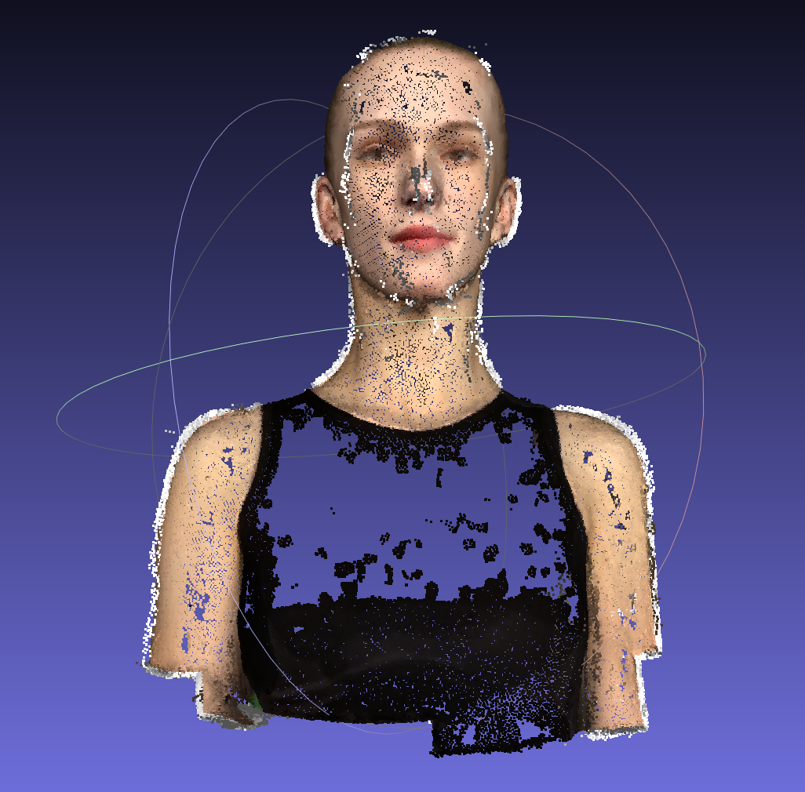

# Assignment 3 - Bundle Adjustment

### 1. 实现基于PyTorch的Bundle Adjustment
实现Bundle Adjustment算法，从2D观测恢复3D点坐标、相机参数（旋转、平移）和焦距。

### 2. 使用COLMAP进行3D重建
使用COLMAP对50张渲染图像进行完整的稀疏重建和稠密重建。

---

## Implementation of Bundle Adjustment

This repository is the implementation of Assignment 03 of DIP (Digital Image Processing).

---

## Requirements

To install the required libraries:

```setup
pip install torch torchvision numpy opencv-python
```

---

## Running

To run the Bundle Adjustment optimization:

```bash
python bundle_adjustment.py
```

To visualize the reconstructed point cloud:

```bash
python visualize_point_cloud.py
```

To visualize the COLMAP dense reconstruction (PLY file):

```bash
python visualize_ply.py
```

---

## Method Description

### 1. Bundle Adjustment with PyTorch

基于 PyTorch 优化器机制实现Bundle Adjustment（光束法平差）。算法致力于从2D观测点恢复完整的3D结构和相机参数：

- **投影函数**：根据相机内参（焦距f）和外参（旋转R、平移T），将3D点投影到2D像素坐标
  - 投影公式：`u = -f * Xc/Zc + cx`，`v = f * Yc/Zc + cy`
  - 其中 `[Xc, Yc, Zc] = R @ [X, Y, Z]^T + T`

- **参数化**：
  - 相机内参：焦距f（所有相机共享）
  - 相机外参：使用Euler角参数化旋转（3个参数），平移向量（3个参数）
  - 3D点坐标：每个点3个参数

- **优化目标**：最小化2D重投影误差（predicted 2D - observed 2D的距离）

- **初始化**：
  - 焦距：基于60度FoV初始化
  - 旋转：初始化为单位矩阵（Euler角为0）
  - 平移：初始化为[0, 0, -2.5]（相机在物体前方2.5单位）
  - 3D点：初始化为原点附近的随机位置

### 2. COLMAP 3D Reconstruction

使用COLMAP进行完整的3D重建流程：

- **特征提取** (Feature Extraction)：使用SIFT算法提取图像特征点
- **特征匹配** (Feature Matching)：对所有图像对进行特征匹配
- **稀疏重建** (Sparse Reconstruction / Mapper)：使用增量式SfM算法进行稀疏重建
- **稠密重建** (Dense Reconstruction)：
  - Image Undistortion：图像去畸变
  - Patch Match Stereo：多视角立体匹配
  - Stereo Fusion：融合生成稠密点云

---

## Results

### Bundle Adjustment

> PyTorch实现的光束法平差优化过程



> 重建的3D点云



---

### COLMAP 3D Reconstruction

> COLMAP稠密重建结果



---

## Conclusion

1. **Bundle Adjustment实现**：
   - 成功从2D观测恢复出3D点坐标、相机参数和焦距
   - 优化过程收敛良好，loss从23045.45下降到0.19
   - 生成的3D点云包含颜色信息，可在Blender或其他3D软件中查看

2. **COLMAP重建**：
   - 提供了完整的3D重建流程，包括特征提取、匹配、稀疏重建和稠密重建
   - 生成的稠密点云可用于进一步的分析和应用

3. **对比分析**：
   - 我们的Bundle Adjustment实现专注于从已知的2D投影恢复3D结构
   - COLMAP则是一个完整的3D重建系统，从原始图像开始，自动检测特征点并进行匹配
   - 两者都使用了Bundle Adjustment技术，但应用场景不同

---

## Acknowledgement

>📋 Assignments based on:
- [Bundle Adjustment - Wikipedia](https://en.wikipedia.org/wiki/Bundle_adjustment)
- [COLMAP - Structure-from-Motion Revisited](https://colmap.github.io/)
- [Multi-View Geometry](http://www.cvlibs.net/books/MVG.html)
