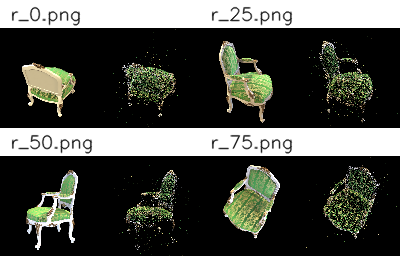
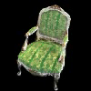
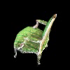
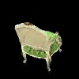
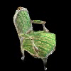
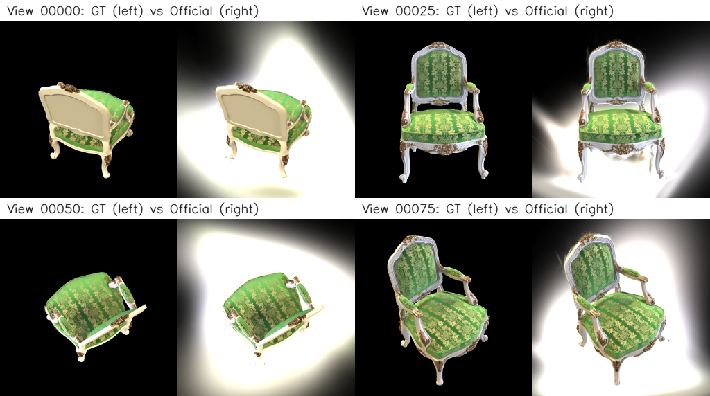

# Assignment 4 - Simplified 3D Gaussian Splatting

### 1. 使用 COLMAP 完成多视角稀疏重建
从多视角图像中恢复相机内外参，并生成稀疏 3D 点云，作为 3D Gaussian Splatting 的初始化。

### 2. 使用 PyTorch 实现简化版 3D Gaussian Splatting
基于 COLMAP 的稀疏点，将场景表示为一组可优化的 3D Gaussians，并通过可微投影与 alpha-blending 完成渲染。

### 3. 与官方 3DGS 实现进行对比
从渲染质量、训练速度和显存占用三个方面，对课程实现与官方实现进行实验对比。

---

## Implementation of Simplified 3DGS

This repository is the implementation of Assignment 04 of DIP (Digital Image Processing).

---

## Requirements

To install the required libraries:

```setup
pip install torch torchvision numpy opencv-python matplotlib
```

Task 1 additionally requires COLMAP.

---

## Running

### Task 1: COLMAP Reconstruction

```bash
python mvs_with_colmap.py --data_dir data/chair
python debug_mvs_by_projecting_pts.py --data_dir data/chair
```

### Task 2: Simplified 3DGS Training

```bash
python train.py --colmap_dir data/chair --checkpoint_dir data/chair/checkpoints
```

### Render a Multi-view Video

```bash
python render_3dgs_mv.py \
    --colmap_dir data/chair \
    --checkpoint data/chair/checkpoints/checkpoint_000060.pt \
    --num_frames 240 --fps 30
```

---

## Method Description

### 1. Structure-from-Motion with COLMAP

本实验首先使用 COLMAP 对 `data/chair/images/` 中的 100 张多视角图像进行稀疏重建。整体流程包括：

- **特征提取**：使用 SIFT 从每张图像中提取局部特征。
- **特征匹配**：使用 exhaustive matcher 对所有图像对进行匹配。
- **稀疏重建**：通过增量式 SfM 恢复相机位姿与稀疏三维点。
- **结果验证**：将恢复得到的稀疏三维点重新投影回原始图像，检查投影位置是否与物体轮廓基本一致。

COLMAP 输出的稀疏点云为后续 3DGS 初始化提供了点位置、相机内参和外参。

### 2. Simplified 3D Gaussian Splatting

本实验实现的是一个简化版 3D Gaussian Splatting。与官方实现相比，本实现完全基于 PyTorch，未使用 tile-based rasterizer，也未实现 adaptive densification。

每个 3D Gaussian 由以下参数表示：

- **Position $\mu$**：由 COLMAP 稀疏三维点初始化。
- **Rotation $R$**：使用单位四元数参数化。
- **Scaling $S$**：使用三个方向上的尺度控制高斯形状。
- **Opacity $o$**：控制该高斯对像素的贡献强度。
- **Color $c$**：使用 RGB 颜色表示外观。

具体实现过程如下：

#### 2.1 3D Gaussian Initialization

根据论文公式，三维协方差矩阵写为：

$$
\Sigma = R S S^T R^T
$$

其中 $R$ 由四元数转换得到，$S$ 为对角缩放矩阵。这样可以保证协方差矩阵是对称正定的，并可在训练中稳定优化。

#### 2.2 Project 3D Gaussians to 2D

给定相机内参矩阵 $K$、旋转矩阵 $R$ 和平移向量 $t$，先将 3D Gaussian 中心投影到相机坐标系，再通过透视投影映射到像素平面。对协方差的传播采用一阶近似：

$$
\Sigma' = J W \Sigma W^T J^T
$$

其中 $W$ 是世界坐标到相机坐标的线性变换，$J$ 是透视投影的雅可比矩阵。

#### 2.3 Compute 2D Gaussian Values

投影到图像平面后，每个 Gaussian 在像素 $\mathbf{x}$ 处的值为：

$$
f(\mathbf{x}; \boldsymbol{\mu}_i, \boldsymbol{\Sigma}_i)
= \frac{1}{2\pi\sqrt{|\boldsymbol{\Sigma}_i|}}
\exp\left(-\frac{1}{2}(\mathbf{x} - \boldsymbol{\mu}_i)^T
\boldsymbol{\Sigma}_i^{-1}
(\mathbf{x} - \boldsymbol{\mu}_i)\right)
$$

这里使用二维协方差矩阵的逆矩阵与行列式完成马氏距离和归一化项计算。

#### 2.4 Volume Rendering via Alpha-blending

所有 Gaussian 按深度从近到远或从远到近排序后，使用 alpha-blending 累积颜色。对于第 $i$ 个 Gaussian：

$$
\alpha_{(\mathbf{x}, i)} = o_i \cdot f(\mathbf{x}; \boldsymbol{\mu}_i, \boldsymbol{\Sigma}_i)
$$

透射率为：

$$
T_{(\mathbf{x}, i)} = \prod_{j < i}(1 - \alpha_{(\mathbf{x}, j)})
$$

最终像素颜色由所有 Gaussian 的颜色贡献加权求和得到。

---

## Results

### 1. COLMAP Sparse Reconstruction

Task 1 中，COLMAP 成功恢复了 `chair` 场景的相机位姿和稀疏三维点，并生成了重投影可视化结果。重投影结果表明，大多数三维点能够较好地回到物体轮廓附近，说明相机参数恢复基本正确。

下图展示了 4 个视角下的重投影结果。每张图左侧为原始图像，右侧为 COLMAP 恢复的稀疏三维点投影结果。可以看到，投影点整体能够贴合椅子的轮廓和主要结构，这说明恢复的相机参数与稀疏几何具有较好的一致性。



### 2. Simplified 3DGS Rendering Result

本实验完成训练后，生成了一个绕场景水平旋转的多视角渲染视频，用于观察重建质量与几何一致性。

- **结果视频**：`04_3DGS/render_mv.mp4`

从视频中可以观察到：

- 物体整体轮廓已经被较稳定地重建出来。
- 在大视角变化下，颜色与结构具有一定连续性。
- 与官方方法相比，课程实现存在更明显的模糊、细节损失和局部伪影。

为了便于在 Markdown 报告中直接展示，这里从结果视频中均匀截取了 4 帧作为定性结果：

| View 1 | View 2 |
|------|------|
|  |  |
|  |  |

这些结果说明该简化版 3DGS 已经能够生成连续的多视角外观，并在视角变化过程中保持基本稳定的结构轮廓。

如果 Markdown 查看器支持 HTML，也可以直接嵌入完整视频：

```html
<video src="render_mv.mp4" controls width="800"></video>
```

由于课程实现当前主要保留的是环绕渲染视频，因此这里使用视频关键帧作为课程方法的定性结果展示。

### 3. Comparison with Official 3DGS

本实验将课程实现与官方 3DGS 在同一 `chair` 场景上进行了对比。当前已经统计到训练时间与显存占用结果。

#### 3.1 Efficiency Comparison

| Method | Training Time | Peak GPU Memory | Notes |
|------|------:|------:|------|
| Ours (Simplified PyTorch 3DGS) | 17775.31 s ($\approx$ 4 h 56 min 15 s) | 9.199 GB | Pure PyTorch implementation |
| Official 3DGS | 6 min | 12 GB | Official optimized implementation |

从结果可以看出：

- **训练速度**：官方实现明显更快。课程实现训练耗时约 4 小时 56 分，而官方实现仅约 6 分钟，速度差距非常显著。
- **显存占用**：课程实现峰值显存约 9.199 GB，低于官方实现记录的约 12 GB。

#### 3.2 Quality Comparison

当前已经统计得到课程实现的定量指标，并根据官方输出结果计算了对应指标。需要注意的是，官方导出的渲染图使用了亮背景，而对应的 GT 图像为黑背景。如果直接在整张图上计算，背景差异会显著拉低分数，不能真实反映前景重建质量。因此，这里对官方结果采用 **GT 前景掩码评估**，即仅保留 GT 前景区域后再计算 PSNR 和 SSIM。

| Method | PSNR | SSIM | Views | Notes |
|------|------:|------:|------:|------|
| Ours | 22.2942 ± 1.6403 dB | 0.9130 ± 0.0201 | 100 | User-provided evaluation result |
| Official 3DGS | 26.3092 ± 0.7115 dB | 0.9700 ± 0.0049 | 100 | Computed on foreground-masked images |

作为对照，若忽略背景设置差异，直接对官方整张图计算，会得到明显失真的低分结果（PSNR 3.6908 dB，SSIM 0.2498），因此报告中不采用该口径。

为了补充定性结果，下面给出官方方法在 4 个训练视角上的 GT / Render 对比图。每个子图左侧为 GT，右侧为官方 3DGS 渲染结果。可以看到，官方方法在主体边缘、织物纹理和金属装饰等细节上恢复得更加清晰，但背景照明设定与 GT 不一致，因此后续定量评估采用前景掩码口径。



综合课程方法的视频结果、官方方法的训练视角重建图以及上表中的定量结果，可以认为官方方法在当前场景上的重建质量明显优于课程实现。如果后续还希望补充更完整的感知质量比较，可以进一步加入 LPIPS 指标。

#### 3.3 Discussion

课程实现与官方实现的差异主要来自以下几个方面：

1. **光栅化实现差异**  
   课程实现直接基于 PyTorch 张量操作完成高斯投影和 alpha-blending，尽管实现直观，但像素级并行效率较低。官方实现使用了专门优化的高性能 rasterizer，因此在训练速度上显著优于课程实现。

2. **是否使用 densification**  
   课程实现以 COLMAP 的稀疏点为初始高斯集合，并在训练过程中保持点数基本固定。官方实现则支持 adaptive densification，能够在训练中动态增加或调整 Gaussian 数量，因此能更好地拟合复杂几何和细节。

3. **内存与计算方式差异**  
   课程实现虽然速度慢，但实现简单直接，显存峰值相对可控。官方实现为了追求更高质量和更快速度，会使用更加复杂的数据结构和并行策略，因此显存占用更高。

4. **渲染质量差异**  
   从定性结果来看，课程实现能够恢复物体整体形状与主颜色分布，但在细节锐度、边缘清晰度和跨视角一致性方面仍明显落后于官方实现。官方方法对纹理和细结构的保留更好，伪影更少。

---

## Conclusion

1. **Task 1: COLMAP 初始化**
   - 成功使用 COLMAP 恢复了 `chair` 场景的相机内外参与稀疏三维点。
   - 重投影结果说明恢复得到的几何与相机参数是有效的，可作为后续 3DGS 的初始化。

2. **Task 2: Simplified 3DGS 实现**
   - 成功基于 PyTorch 实现了简化版 3D Gaussian Splatting，包括三维协方差构造、二维投影、Gaussian 值计算和 alpha-blending 渲染。
   - 模型能够生成连续多视角渲染结果，验证了完整 pipeline 的可行性。

3. **Task 3: 与官方实现对比**
   - 官方实现训练速度远快于课程实现。
   - 课程实现显存占用略低，但渲染质量和细节表现仍逊于官方实现。
   - 差异的根本原因在于实现层面的高性能优化、tile-based rasterization 以及 adaptive densification 等机制。

总体而言，本实验完整复现了一个简化版 3DGS 的核心流程，使我们较系统地理解了从 SfM 初始化到可微高斯渲染的关键步骤，也清楚看到了课程实现与工业级优化实现之间的差距。

---

## Acknowledgement

- [3D Gaussian Splatting for Real-Time Radiance Field Rendering](https://repo-sam.inria.fr/fungraph/3d-gaussian-splatting/3d_gaussian_splatting_low.pdf)
- [Official 3D Gaussian Splatting Implementation](https://github.com/graphdeco-inria/gaussian-splatting)
- [COLMAP](https://colmap.github.io/)
- DIP course materials
